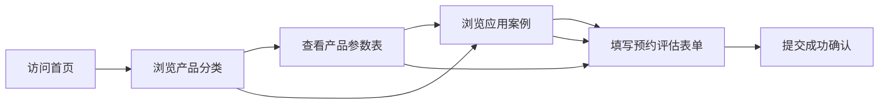

## 1. 产品概述

工业机器人公司官网，展示焊接、码垛、喷涂和检测四大类工业机器人产品，提供真实的产品参数、产线案例和方案预约服务。面向制造业企业决策者、工厂工程师和采购人员，帮助客户快速了解机器人技术规格和应用价值。

- 核心目标：通过清晰的产品参数和真实案例数据，建立专业可信的品牌形象，获取销售线索
- 目标用户：制造业工厂负责人、生产工程师、设备采购人员、自动化项目决策者
- 市场价值：填补工业机器人领域"重图片轻参数"的普遍问题，以数据驱动的方式展示产品价值

## 2. 核心功能

### 2.1 用户角色

| 角色 | 访问方式 | 核心权限 |
|------|---------|----------|
| 访客用户 | 直接访问 | 浏览产品、查看案例、提交预约评估表单 |

### 2.2 功能模块

1. **首页**：导航栏、Hero 英雄区、产品分类概览、核心优势、案例精选、预约评估 CTA、页脚
2. **产品中心**：焊接机器人、码垛机器人、喷涂机器人、检测机器人四大品类，每类包含产品列表和详细参数表
3. **应用案例**：产线问题描述、解决方案说明、效果数据对比（时间、成本、效率提升）
4. **预约评估**：表单收集客户信息（公司、姓名、电话、需求描述），提交后显示成功提示

### 2.3 页面详情

| 页面名称 | 模块名称 | 功能描述 |
|---------|---------|----------|
| 首页 | 导航栏 | 固定顶部，Logo + 产品中心/应用案例/关于我们/预约评估导航项 |
| 首页 | Hero 区域 | 大标题 + 副标题 + 主 CTA 按钮（预约方案评估）+ 工业背景图 |
| 首页 | 产品分类 | 四大类机器人卡片，图标 + 名称 + 简短描述 + 查看详情按钮 |
| 首页 | 核心优势 | 数据展示区：服务客户数、交付产线数、效率提升率、行业经验年数 |
| 首页 | 案例精选 | 3个精选案例卡片，展示产线问题和效果数据摘要 |
| 首页 | 预约评估 CTA | 全宽 Banner，引导用户预约免费方案评估 |
| 产品详情页 | 产品介绍 | 产品主图 + 核心特点列表 |
| 产品详情页 | 参数表格 | 详细技术参数表（型号、负载、工作半径、重复精度、速度、重量等） |
| 产品详情页 | 应用场景 | 该产品适用的行业和工位场景 |
| 案例详情页 | 问题描述 | 客户面临的产线痛点和挑战 |
| 案例详情页 | 解决方案 | 采用的机器人型号、系统配置、实施过程 |
| 案例详情页 | 效果数据 | 改造前后对比数据：效率、成本、良率、ROI |
| 预约评估页 | 表单 | 公司名称、联系人、手机号、邮箱、行业、需求描述、提交按钮 |
| 预约评估页 | 成功状态 | 提交成功提示，预计响应时间说明 |

## 3. 核心流程

访客浏览流程：访问首页 → 浏览产品分类 → 查看产品详细参数 → 浏览应用案例 → 提交预约评估表单 → 获得成功确认

## 4. 用户界面设计

### 4.1 设计风格

- **设计方向**：工业科技风 / 硬核专业感，强调精密、可靠、高效
- **主色调**：深空蓝 (#0A1628) - 代表科技与专业
- **辅助色**：工业橙 (#FF6B2C) - 强调按钮和关键数据
- **中性色**：深灰 (#1A1A1A)、中灰 (#6B7280)、浅灰 (#F3F4F6)、白色 (#FFFFFF)
- **按钮风格**：直角或微圆角（4px），实心工业橙主按钮 + 描边次按钮
- **字体**：标题使用思源黑体 Bold / 粗体，正文使用思源黑体 Regular，参数表使用等宽数字
- **布局风格**：网格系统，卡片式布局，大量数据表格，清晰的信息层级
- **视觉元素**：网格线、科技感边框、数据仪表盘样式、细微的金属质感渐变
- **图标风格**：线性图标，工业设备风格，简洁有力

### 4.2 页面设计概览

| 页面名称 | 模块名称 | UI 元素 |
|---------|---------|---------|
| 首页 | Hero 区域 | 全屏高度，左侧大标题+描述+CTA，右侧工业机器人场景图，深色背景+橙色光效 |
| 首页 | 产品分类 | 4列网格卡片，深色卡片背景，图标+标题+描述+箭头链接，hover 上浮效果 |
| 首页 | 核心数据 | 4个大数字展示，工业橙强调数字，浅色背景区 |
| 首页 | 案例精选 | 3列卡片，每张包含问题摘要、方案标签、效果数据（提升率） |
| 产品详情页 | 参数表格 | 斑马纹表格，关键参数高亮，左侧参数名右侧参数值，清晰易读 |
| 案例详情页 | 数据对比 | 改造前后数据卡片对比，用进度条可视化提升比例 |
| 预约评估页 | 表单 | 左侧表单+右侧联系方式，输入框有工业风格边框，提交按钮工业橙 |

### 4.3 响应式

- 桌面端优先设计（1200px 以上）
- 平板端（768-1199px）：4列变2列，参数表格保持完整
- 移动端（375-767px）：单列布局，导航变汉堡菜单，参数表格可横向滚动
- 触摸优化：按钮最小尺寸 44px，表单输入框足够大便于触摸

### 4.4 交互动效

- 页面滚动时元素渐入（staggered reveal）
- 产品卡片 hover 时轻微上浮 + 阴影加深
- 数字计数器动画（滚动到视口时从0计数到目标值）
- 表单提交后成功状态动画
- 导航栏滚动时背景从透明变实色
