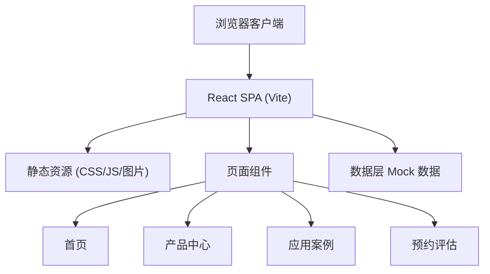

## 1. 架构设计



## 2. 技术描述

- **前端框架**：React 18 + TypeScript
- **构建工具**：Vite 5
- **样式方案**：Tailwind CSS 3
- **路由管理**：React Router v6
- **状态管理**：React Hooks (useState, useEffect)
- **图标库**：Lucide React
- **后端**：无（纯静态网站，表单使用前端模拟提交）
- **数据**：Mock 数据硬编码在前端组件中
- **部署**：静态文件部署

## 3. 路由定义

| 路由路径 | 页面名称 | 说明 |
|---------|---------|------|
| `/` | 首页 | 产品概览、核心数据、案例精选、CTA |
| `/products` | 产品中心 | 四大类机器人产品列表及参数 |
| `/products/:type` | 产品分类页 | 某类机器人的产品列表和参数详情 |
| `/cases` | 应用案例 | 产线案例列表，展示问题-方案-效果 |
| `/cases/:id` | 案例详情页 | 单个案例的详细信息和数据对比 |
| `/consult` | 预约评估 | 方案评估预约表单 |

## 4. 组件结构

```
src/
├── components/
│   ├── layout/
│   │   ├── Header.tsx       # 顶部导航栏
│   │   ├── Footer.tsx       # 页脚
│   │   └── Layout.tsx       # 布局容器
│   ├── home/
│   │   ├── Hero.tsx         # Hero 区域
│   │   ├── ProductCategories.tsx  # 产品分类卡片
│   │   ├── Stats.tsx        # 核心数据统计
│   │   └── CaseShowcase.tsx # 案例精选
│   ├── products/
│   │   ├── ProductCard.tsx  # 产品卡片
│   │   └── SpecTable.tsx    # 参数表格
│   ├── cases/
│   │   ├── CaseCard.tsx     # 案例卡片
│   │   └── DataCompare.tsx  # 数据对比组件
│   └── consult/
│       └── ContactForm.tsx  # 预约表单
├── pages/
│   ├── Home.tsx
│   ├── Products.tsx
│   ├── ProductDetail.tsx
│   ├── Cases.tsx
│   ├── CaseDetail.tsx
│   └── Consult.tsx
├── data/
│   ├── products.ts          # 产品 mock 数据
│   └── cases.ts             # 案例 mock 数据
├── types/
│   └── index.ts             # TypeScript 类型定义
├── App.tsx
├── main.tsx
└── index.css
```

## 5. 数据模型

### 5.1 产品数据类型

```typescript
interface RobotProduct {
  id: string;
  name: string;
  category: 'welding' | 'palletizing' | 'spraying' | 'inspection';
  categoryName: string;
  model: string;
  image: string;
  description: string;
  features: string[];
  specifications: {
    payload: string;        // 负载
    reach: string;          // 工作半径
    repeatability: string;  // 重复定位精度
    axisSpeed: string;      // 轴速度
    weight: string;         // 本体重量
    installation: string;   // 安装方式
    protection: string;     // 防护等级
    [key: string]: string;  // 其他参数
  };
  applications: string[];   // 应用场景
}
```

### 5.2 案例数据类型

```typescript
interface CaseStudy {
  id: string;
  title: string;
  industry: string;
  client: string;
  image: string;
  problem: string;         // 产线问题
  challenges: string[];    // 具体挑战
  solution: {
    robots: string[];      // 使用的机器人型号
    system: string;        // 系统方案
    implementation: string; // 实施周期
  };
  results: {
    before: {              // 改造前数据
      efficiency: number;
      cost: number;
      yieldRate: number;
      [key: string]: number;
    };
    after: {               // 改造后数据
      efficiency: number;
      cost: number;
      yieldRate: number;
      [key: string]: number;
    };
    roi: string;           // 投资回报周期
  };
}
```

### 5.3 预约表单数据类型

```typescript
interface ConsultForm {
  company: string;
  contact: string;
  phone: string;
  email: string;
  industry: string;
  requirement: string;
}
```

## 6. 性能与优化

- 使用 Vite 构建优化，代码分割
- 图片使用合适尺寸和格式，按需加载
- 组件懒加载（React.lazy）
- 滚动触发动画使用 Intersection Observer
- 响应式图片，避免移动端加载过大资源
